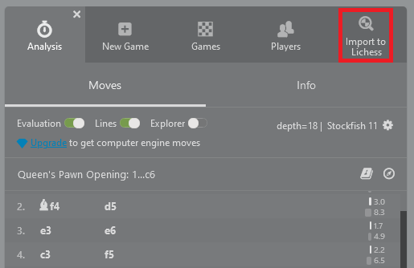

# Lichess Importer for Chess.com

A userscript to add a button to Chess.com to easily import games to Lichess.

This gives an easy way to use Lichess' free analysis and review tools with Chess.com games, as well as Lichess' various other features,
such as the opening explorer and tablebase, infinite local analysis, and practice from position with computer.

## Usage

On a live game page, click the "Import to Lichess" button in the sidebar on Chess.com and a Lichess page with the imported game should open automatically.

BUG: Currently, you may need to reload once when either during or after a game (particularly on a chess.com/game/live/* url) to use the button (keep in mind the button also takes 3 seconds to appear).
This particularly occurs when pressing "Play" from the main menu.

You may need to manually enable popups for the page in your browser for this to work. Please only use this for post-game analysis and do not use this to cheat.

## Installation

To use the userscript, a userscript manager extension is required for your browser. 

This was tested with the open source [Violentmonkey](https://violentmonkey.github.io/) and is what I recommend.
Some other popular options are [Tampermonkey](https://www.tampermonkey.net/) (not open source) and [Greasemonkey](https://github.com/greasemonkey/greasemonkey) (open source), but many more exist.

After installing a userscript support manager, you can [click here to install](https://github.com/KaranveerB/Lichess-Importer-for-Chess.com/raw/master/LichessImporterForChess-com.user.js).

## TODO
- Fix needing to reload to see button (clicking a new game doesn't actually redirect, hence doesn't load)
- Deter cheating with better design
- Determine better way to load script (currently waits 3 seconds for certain elements to load)
- Get imports with timestamps working (if Lichess supports it)
- Properly implement code so enabling pop-ups is not required
